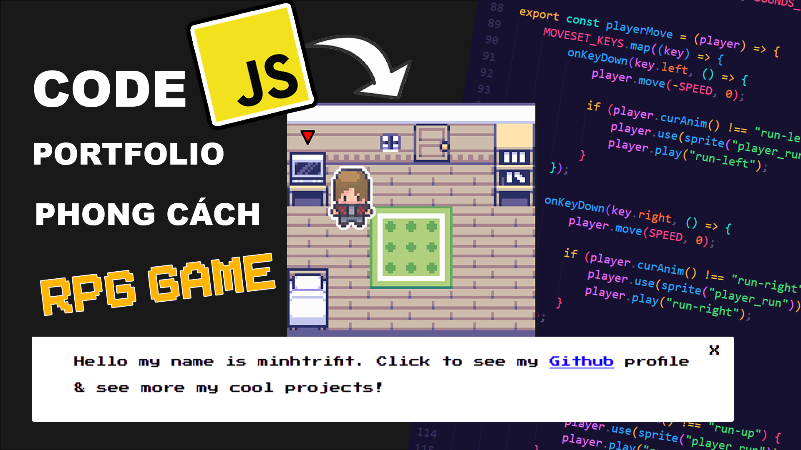

# PORTFOLIO 2D RPG GAME BẰNG JAVASCRIPT

 



🎓 📚 Đây là dự án xây dựng trang Portfolio theo phong cách game 2D RPG bằng JavaScript

## 💻 Công nghệ sử dụng

<p align="left"> <a href="https://www.w3.org/html/" target="_blank" rel="noreferrer">  <a href="https://www.w3schools.com/css/" target="_blank" rel="noreferrer">  <a href="https://developer.mozilla.org/en-US/docs/Web/JavaScript" target="_blank" rel="noreferrer">  </p>

## 📦 Cài đặt dự án

Cài đặt các gói & thư viện cần thiết

```console
npm install
```

hoặc cài đặt với legacy peer dependencies.

```console
npm install --legacy-peer-deps
```

Khởi chạy dự án (supported by [Vite](https://vitejs.dev/guide/))

```console
npm run dev
```

## ▶️ YouTube Demo

[](https://youtu.be/vwDPnmYpn-w)

## 💌 Kết nối

- Author - [minhtrifit](https://minhtrifitdev.netlify.app)
- [⚡ Github](https://github.com/minhtrifit)
- [🔴 Youtube](https://www.youtube.com/@minhtrifit)

> CopyRight© minhtrifit
